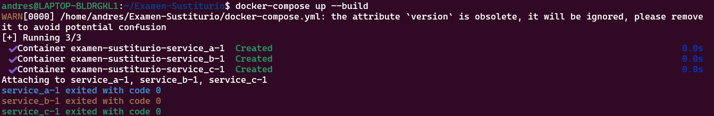

# Examen sustiturio DS-Proyecto 3 
Alumno: La Torre Vasquez Andres 

Codigo: 20212100C 
## Parte 1 - Algoritmo sobre el grafo de git 

Para empezar en este proyecto queremos que el codigo pueda abrir y parsear los archivos en .git/object/<xx>/<yyyy> usando libreria zlib no git log ni rev-list para esto definimos la funcion **parse_git_object**

```python
    import zlib
    def parse_git_object(object_dir, object_hash):
    # Abre y descomprime un objeto git
    path = os.path.join(".git", "objects", object_dir, object_hash)
    with open(path, "rb") as f:
        compressed = f.read()
    return zlib.decompress(compressed)
```
Para esto cada objeto commit expone la lista de padres y necesitamos construir un grafo dirigido donde los nodos son SHA-1 de commits y las aristas apuntan a sus padres 

Metricas : 
Densidad de ramas : Para cada nivel de profundida i(distancia minimo del head la nodo) calcula nodes_i/i, luego suma para todos los niveles y divide por el total de niveles 

critical path: definir "deuda de merges" como secuencias de merges consecutivos (commits con >1 padre ). Aplica dijkstra inverso para hallar el camino desde el head hasta un tag raiz v0.0.0 que minimize la suma de "deuda" 

Top-k bottleneck commits identifica los k=5 commits con mayor indegree(>2)

```json
    ## caso cuando habiamos hecho 2 commits en rama feature
    {
    "densidad": 0.75,
    "ruta_critica": [],
    "cuellos_de_botella": []
    }
```

Salida: generar git analysis.json con campos density:float, critical path:[sha...], bottlenecks:[sha...]

Referencias usadas:
https://stackoverflow.com/questions/70944136/decompressing-git-objects-with-zlib


## Parte 2 - Mediator- Based Service Mesh 

Definimos 3 microservicios A,B y C cada uno con su propio contenedor docker basados en python Definimos POST/task que reciba el json {data:trace_id:uuid...} y devuelva {data processed., trace_id,...} 
B implica alguna transformacion y C finaliza el proceso 

```python
# Servicio A para recibir datos y retornar un trace_id y se conecta a un endpoint específico.
from flask import Flask, request, jsonify
import uuid
app = Flask(__name__)

@app.route('/task', methods=['POST'])
def task():
    data = request.json
    # Procesa y retorna el mismo trace_id para enviar a otros servicios
    return jsonify({"data": f"A:{data['data']}", "trace_id": data["trace_id"]})

if __name__ == '__main__':
    app.run(host='0.0.0.0', port=5001)


## los demas servicios con una estructura similar pero no lo pongo aqui para no sobrecargar el readme
```

Mediator mesh.py 
Implementamos un objeto mediator que registra referencias a servicios A B C y define execute(data) que envia a A recibe respuesta o lanza excepcion tras 3 reintentos con backoff exponencial , envia a B gestiona si B responde lento (>500 ms) y C realiza logging del trace_id en stdout
```python
class Mediator:
    def __init__(self, service_a_url, service_b_url, service_c_url):
        self.service_a = service_a_url
        self.service_b = service_b_url
        self.service_c = service_c_url

```

Exponer una facade sencilla mesh.run_cli(data,trace_id) que lee json de stdin y escribe json en stdout 

```python
import json
def run_cli():
    entrada = sys.stdin.read()
    req = json.loads(entrada)
    mediator = Mediator('http://service_a:5001', 'http://service_b:5002', 'http://service_c:5003')
    resultado = mediator.execute(req)
    print(json.dumps(resultado))
```

Docker compose 

Generamos un docker compose via un builder en compose builder.py que permiten encadenar servicios, redes y volumenes.Compose incluye un unico network mesh-net 

```python
if __name__ == '__main__':
    # Creamos los 3 servicios A , B y C con imagenes de Python 3.9 predefinidas y establecemis dependencias
    a = Service('service_a', 'python:3.9', ['5001:5001'])
    b = Service('service_b', 'python:3.9', ['5002:5002'], depends_on=['service_a'])
    c = Service('service_c', 'python:3.9', ['5003:5003'], depends_on=['service_b'])
    # Encadenamos servicios y red mesh-net
    builder = ComposeBuilder()
    builder.add_service(a).add_service(b).add_service(c)
    builder.save('docker-compose.yml')
```



## Parte 3 Bash CI/CD mini-pipeline 
- black --check src/ y flake8 src/
- shellcheck scripts/ci.sh 
```bash
# Ejecutamos black para formatear el codigo
run_black() {
    echo "Ejecutando black..."
    black src/
    if [ $? -ne 0 ]; then
        echo "Error black encontro problemas de formato."
        exit 1
    fi
}
```

## Parte 4 Testing profundo 

- Unit tests 
    - Para git_graph.py usar @pytest.mark.parametrize con DAGs sinteticos y medir densidad y critical path 
    - Para mesh.py usar  monkeypatch.autospec y request-mock para simular servicios A/B/C apagados  
